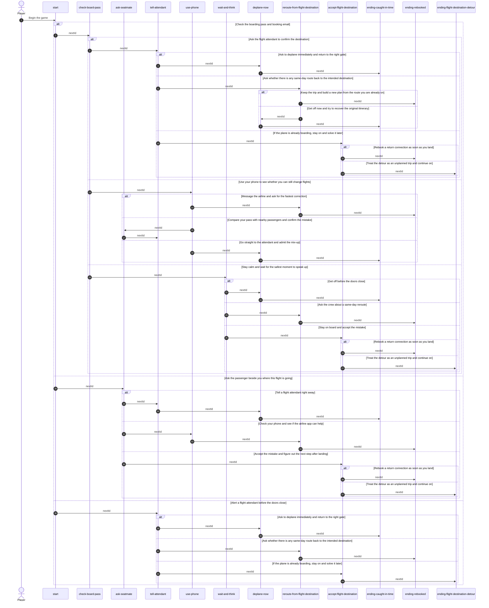

# Wrong Flight Adventure

This README includes a sequence diagram that matches the exact story nodes in `traveller-script.js`.

The diagram mirrors the live story structure in [traveller-script.js](traveller-script.js). The story stays generic: the traveller has boarded the wrong flight and must choose how to still reach the intended destination.
